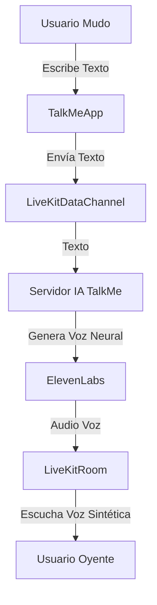

# ¿Qué es LiveKit? (El Motor de TalkMe Video)

LiveKit es una infraestructura de **video y audio en tiempo real** de código abierto. Piensa en él como los "tuberías" invisibles que transportan el video de alta calidad, mientras nosotros construimos la "grifería" de diseño hermosa encima.

## ¿Por qué es perfecto para TalkMe?

1.  **Audio Separado:** Nos permite tomar el audio de *solo una persona*, enviarlo a la IA para traducir, y devolver el texto, todo en milisegundos.
2.  **Soporte Multiplataforma:** Funciona igual en Web, iPhone, Android y Flutter.
3.  **Ancho de Banda Inteligente:** Si el internet del usuario es lento, baja la calidad del video automáticamente, pero *nunca corta el audio*.

## Ejemplo de Código (¡Mira qué simple es!)

Para agregar una sala de video a tu proyecto React, solo necesitamos este código base:

```jsx
import { LiveKitRoom, VideoConference } from '@livekit/components-react';
import '@livekit/components-styles';

function SalaTalkMe() {
  return (
    <LiveKitRoom
      serverUrl="wss://tu-servidor-livekit.io"
      token="tu-token-seguro"
      connect={true}
      video={true}
      audio={true}
      // Aquí conectamos nuestro diseño "Glassmorphism"
      data-lk-theme="default"
    >
      {/* Este componente maneja toda la complejidad por nosotros */}
      <VideoConference />
      
      {/* Aquí pondremos nuestros componentes exclusivos */}
      <TalkMeTranslatorOverlay />
      <TalkMeVoiceInput />
      
    </LiveKitRoom>
  );
}
```

## Arquitectura para TalkMe Inclusivo



## Resumen
Con LiveKit, no tenemos que inventar la rueda de cómo transmitir video. Nos enfocamos 100% en la **Traducción** y la **Accesibilidad**.
